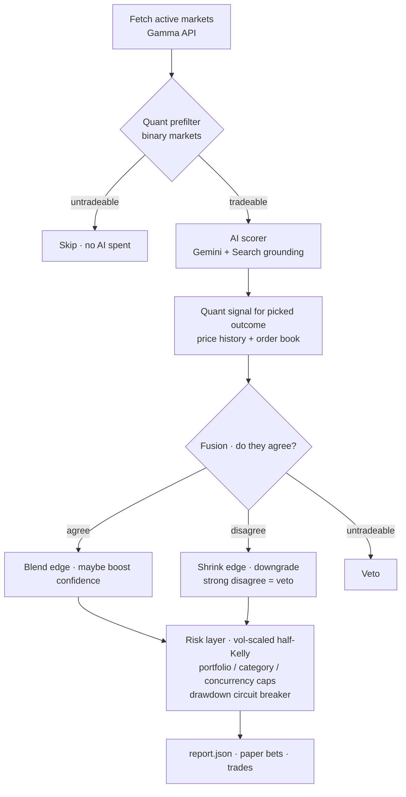

# POLYMARKET-AUTONOMOUS-ANALYST-TRADING-BOT

POLYMARKET AUTONOMOUS ANALYST & TRADING BOT.

The bot scans Polymarket prediction markets and fuses **two independent signals**
to find mispriced opportunities:

1. **AI analyst** — Google **Gemini 2.0 Flash** with built-in Google Search
   grounding estimates a news-driven fair value for each market.
2. **Quant engine** — structured signals computed purely from numbers: CLOB
   price-history features (momentum, mean-reversion, trend, realised volatility)
   and live order-book microstructure (spread, depth-weighted microprice,
   imbalance, tradeable liquidity).

A **fusion layer** combines the two — neither signal trades on its own without
passing the other's sanity check — and a **systematic risk layer** turns the
surviving opportunities into volatility-scaled, portfolio-capped position sizes.
It can run in analyze-only mode, place real (or dry-run) trades, record
hypothetical **paper bets**, **backtest** the quant signal point-in-time, and
serve a live **web dashboard**.

## Why it's cheap

The previous stack used **two paid APIs** (DeepSeek for scoring + Tavily for
news). Both were replaced by a single Gemini call:

| Before | After |
| --- | --- |
| DeepSeek (LLM, paid per token) | Gemini 2.0 Flash (free tier: 1,500 req/day, 15 req/min) |
| Tavily (news search, paid) | Gemini built-in Google Search grounding (no extra service) |

The quant engine is pure Python (`statistics` only — no paid data feed), and the
**quant prefilter runs before the AI call**, so no LLM quota is ever spent on a
market that is untradeable (thin liquidity / wide spread). Net running cost on the
free tier is **$0**.

## How the two signals combine



## Project layout

The implementation lives under `polymarket_bot/`.

| File | Purpose |
| --- | --- |
| `config.py` | Environment, paths, and tunable AI / quant / risk knobs. |
| `fetcher.py` | Fetches and filters active markets from the Gamma API; tags each with a `category` and parses `token_ids` for the quant layer. |
| `categories.py` | Keyword-based market categorisation used for breakdowns and filtering. |
| `scorer.py` | **Gemini** fair-value scoring with Google Search grounding, an optional Pro second opinion, and per-run token tracking. |
| `market_data.py` | **CLOB data layer** — fail-soft price-history and order-book fetchers for the quant engine. |
| `quant.py` | **Quant engine** — price-history features, order-book microstructure, and a directional signal with a tradeability gate. |
| `fusion.py` | **Fusion layer** — blends the AI and quant signals with agreement gating and vetoes. |
| `risk.py` | **Systematic risk** — volatility-scaled half-Kelly sizing with portfolio / category / concurrency caps and a drawdown breaker. |
| `pipeline.py` | Per-market orchestration: quant prefilter → AI → fusion. |
| `backtest.py` | **Point-in-time** quant backtest on resolved markets (no look-ahead bias). |
| `report.py` | Builds, saves, and prints the opportunities report (`report.json`) with sizing + a portfolio summary. |
| `trader.py` | Places real/dry-run orders via the CLOB client. |
| `wallet.py` | Builds the authenticated CLOB client. |
| `paper_trader.py` | Records hypothetical bets and resolves them against the API. |
| `validator.py` | Computes win rate / P&L / calibration and a go-live recommendation. |
| `dashboard.py` | Self-contained FastAPI web dashboard reading local JSON/JSONL. |
| `news.py` | Deprecated stub (Gemini grounds its own news; kept importable for back-compat). |
| `main.py` | CLI entrypoint wiring all modes together. |

Generated data is written to `polymarket_bot/data/` (paper bets, resolved bets,
performance summary, `backtest.json`) and `polymarket_bot/logs/trades.jsonl` (live
trades). These files are git-ignored.

## Quick start

```bash
cd polymarket_bot
cp .env.example .env        # add your GEMINI_API_KEY
pip install -r requirements.txt
python main.py --analyze
```

A free Gemini API key is available from <https://aistudio.google.com/apikey>.

### Environment variables

Set these in `polymarket_bot/.env`:

**AI scoring (Gemini)**
- `GEMINI_API_KEY` — required for market scoring (free tier is sufficient).
- `GEMINI_MODEL` (default `gemini-2.0-flash`), `GEMINI_MODEL_PRO`
  (default `gemini-2.5-pro`).
- `GEMINI_USE_SEARCH` (default `true`) — built-in Google Search grounding.
- `GEMINI_PRO_RECHECK` (default `true`) — Pro second opinion on high-conviction
  picks; set `false` to stay strictly on the Flash free tier.
- `GEMINI_RPM` (default `15`) — requests/min throttle to respect the free tier.

**Quant engine**
- `QUANT_ENABLED` (default `true`), `QUANT_PREFILTER` (default `true`).
- `AI_WEIGHT` / `QUANT_WEIGHT` (default `0.6` / `0.4`) — fusion blend ratio.
- `MIN_BOOK_LIQUIDITY_USDC` (default `200`), `MAX_SPREAD` (default `0.06`) —
  tradeability gates.
- `QUANT_HISTORY_INTERVAL` (default `1w`), `QUANT_HISTORY_FIDELITY` (default `60`),
  `QUANT_MOMENTUM_LOOKBACK` / `QUANT_MA_SHORT` / `QUANT_MA_LONG`.
- `DISAGREEMENT_PENALTY` (default `0.5`).

**Risk / sizing**
- `MAX_BET_USDC` (default `10`), `MIN_EDGE` (default `0.07`),
  `MIN_CONFIDENCE` (default `medium`), `DRY_RUN` (default `true`).
- `KELLY_FRACTION` (default `0.5`), `VOL_SIZING` (default `true`).
- `MAX_PORTFOLIO_EXPOSURE_USDC` (default `50`),
  `MAX_CATEGORY_EXPOSURE_USDC` (default `20`),
  `MAX_CONCURRENT_POSITIONS` (default `5`),
  `MAX_DRAWDOWN_USDC` (default `30`, `0` disables the breaker).
- `MIN_PRICE` / `MAX_PRICE` (extreme-price guard) and `DISABLED_CATEGORIES`.

**Live trading**
- `POLYGON_PRIVATE_KEY` / `POLYGON_WALLET_ADDRESS` — required only for `--trade`.

## CLI modes

```bash
# Analyze only — scan markets and write report.json
python main.py --analyze

# Paper trading — record hypothetical bets (no real USDC), no trades placed.
# Pending paper bets are auto-checked for resolution on every run.
python main.py --paper

# Live/dry-run trading — place orders on the top opportunities
python main.py --trade

# Quant backtest — replay the quant signal point-in-time on resolved markets
python main.py --backtest
python main.py --backtest --backtest-days 60

# Signal validation — print win rate, P&L, calibration, and a recommendation
python main.py --validate

# Web dashboard — browse opportunities, paper bets, resolved bets, and trades
python main.py --dashboard            # http://localhost:8080
python main.py --dashboard --port 9000

# Repeat any scanning mode every N minutes
python main.py --paper --loop 60
```

`--analyze`, `--trade`, and `--paper` all perform a market scan. `--validate`,
`--backtest`, and `--dashboard` read/replay data and exit / serve.

## The quant engine

Unlike the AI scorer (which reads news and reasons in prose), the quant engine
derives signals purely from numbers — the "as close to a quant thing as possible"
half of the bot:

- **Price-history features** (`quant.price_features`) — short/long moving
  averages, momentum, velocity, realised volatility and a mean-reversion z-score
  from the CLOB price series.
- **Order-book microstructure** (`quant.book_features`) — best bid/ask, spread, a
  depth-weighted **microprice** (a classic fair-price estimator), order-book
  **imbalance**, and tradeable liquidity in USDC.
- **Directional signal** (`quant.compute_quant_signal`) — combines momentum +
  imbalance net of mean-reversion into a conviction score in `[-1, 1]`, plus a
  **tradeability gate** that filters illiquid or wide-spread markets *before* any
  capital — or AI budget — is committed.

### Fusion

`fusion.fuse_signals` treats the AI as the fundamental (news) view and the quant
as the microstructure confirmation:

- **Agree** → blended edge, with a confidence bump on strong, tradeable
  confirmation.
- **Disagree** → edge shrunk by `DISAGREEMENT_PENALTY` and confidence
  downgraded; a *strong* quant disagreement **vetoes** the pick.
- **Untradeable** book → veto.
- **No quant data** (CLOB unreachable) → graceful fall back to the AI signal.

### Risk

`risk.size_positions` turns ranked opportunities into stakes with rules a quant
desk would recognise: volatility-scaled **half-Kelly**, a **portfolio** exposure
cap, a per-**category** (correlation) cap, a **concurrency** cap, and a
**drawdown circuit breaker** that throttles (then halts) sizing as recent realised
P&L deteriorates. `report.json` includes the resulting `stake_usdc` per
opportunity and a `portfolio` summary.

### Backtest (honest, no look-ahead)

The AI backfill has look-ahead bias because news is fetched *now*, not at the
historical decision time. The quant signal does **not** share that flaw: CLOB
price history is timestamped, so `--backtest` replays it point-in-time — for each
resolved market it computes the quant signal using only data up to an entry point
and scores it against the known resolution. Results are written to
`data/backtest.json`.

## Recommended workflow

```bash
pip install -r requirements.txt

# Sanity-check the quant edge with no look-ahead bias
python main.py --backtest

# --- PHASE 1: Paper trading (2-3 weeks) ---
python main.py --paper --loop 60     # scan hourly, auto-resolve bets
python main.py --validate            # check signal quality anytime
python main.py --dashboard           # http://localhost:8080 (separate terminal)

# --- PHASE 2: Go live (after --validate shows >60% win rate on 30+ bets) ---
# Set DRY_RUN=false and a small MAX_BET_USDC (e.g. 2) in .env first
python main.py --trade --loop 60
```

## Dashboard

The dashboard is a single FastAPI server with an inline HTML/JS front end — no
database required. It reads `report.json`, `data/paper_bets.jsonl`,
`data/resolved.jsonl`, `data/performance.json`, and `logs/trades.jsonl`, and
auto-refreshes every 60 seconds. Pages:

- **Overview** — high-level stats and the latest top opportunities.
- **Opportunities** — every market flagged as mispriced in the latest scan.
- **Paper Bets** — pending hypothetical bets.
- **Resolved** — closed markets scored against the bot's predictions.
- **Validation** — calibration by confidence and edge bucket, plus recommendations.
- **Live Trades** — real/dry-run orders from the trade log.

Requires `fastapi` and `uvicorn` (included in `requirements.txt`). The dashboard binds to `127.0.0.1` (localhost) by default for safety because its API is unauthenticated. For remote/VPS access, set `DASHBOARD_HOST=0.0.0.0` or pass `--host 0.0.0.0`, and put it behind a firewall/reverse proxy/auth.

## How paper trading validates the signal

1. In `--paper` mode the bot records a fixed hypothetical bet for each top
   opportunity to `data/paper_bets.jsonl`.
2. On every run it queries Polymarket for any pending bet whose market has now
   closed, computes P&L, and appends the outcome to `data/resolved.jsonl`.
3. `--validate` aggregates resolved bets into `data/performance.json`: overall
   win rate, P&L, calibration by confidence/edge bucket, and a go-live
   recommendation. Wait for 30+ resolved bets before drawing conclusions.

## Tests

```bash
pip install pytest
python -m pytest
```
